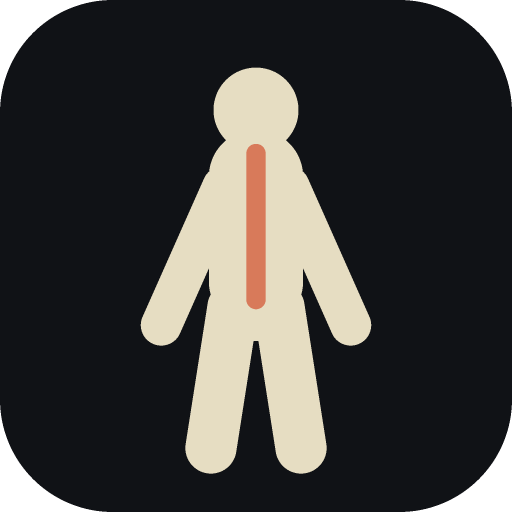
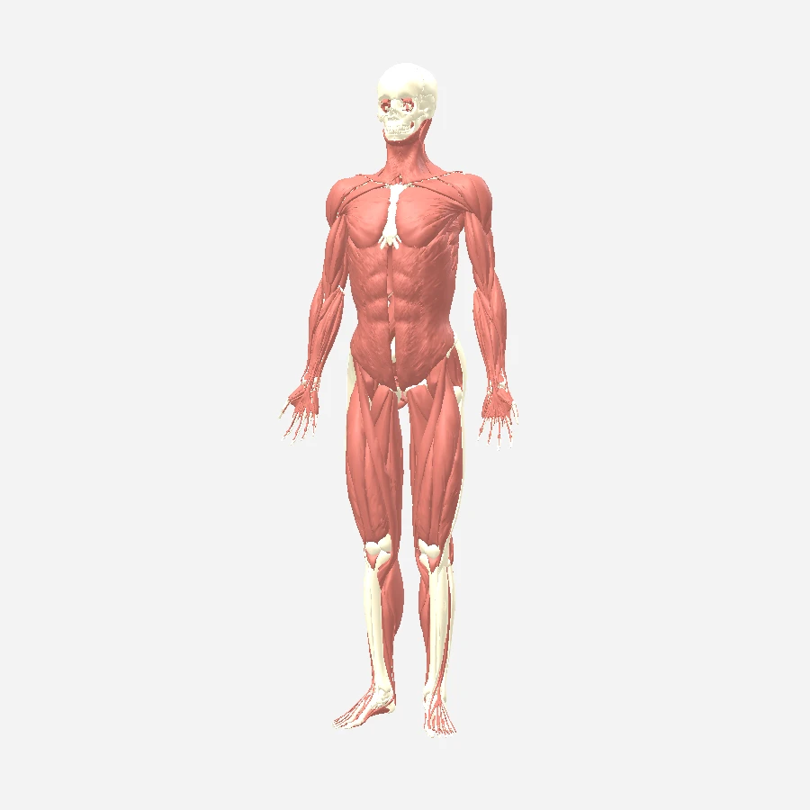
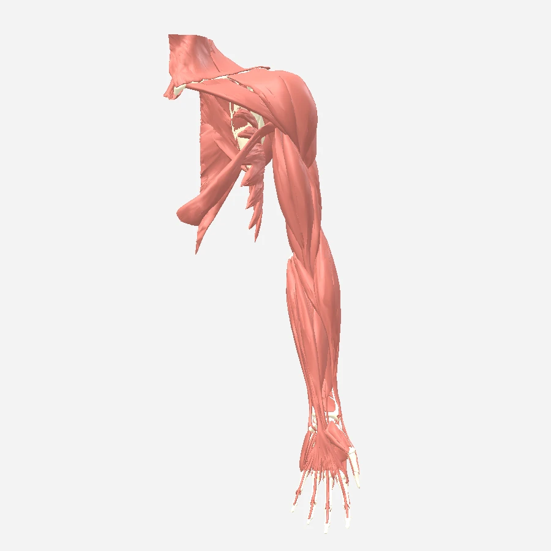
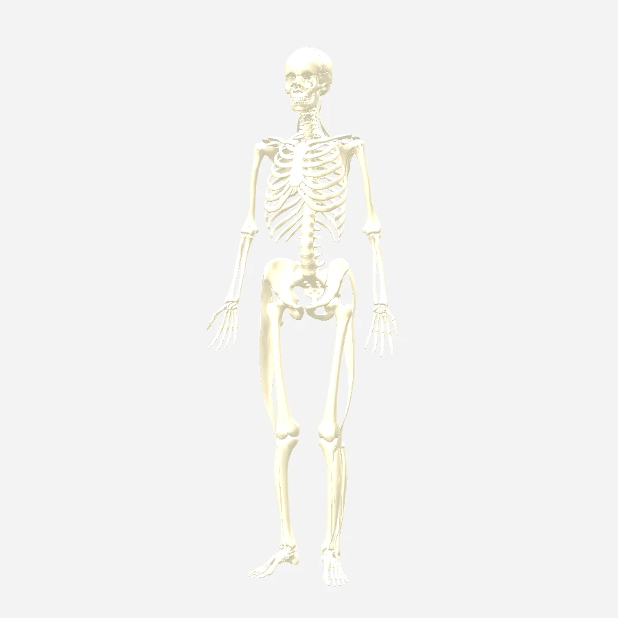
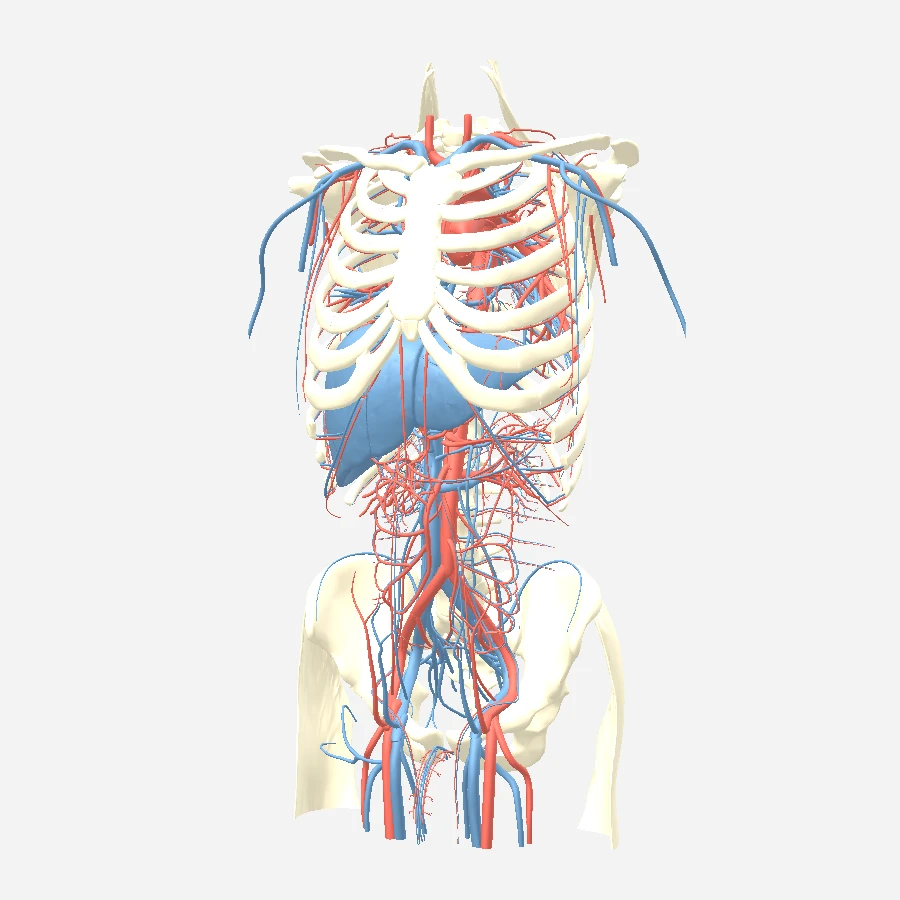
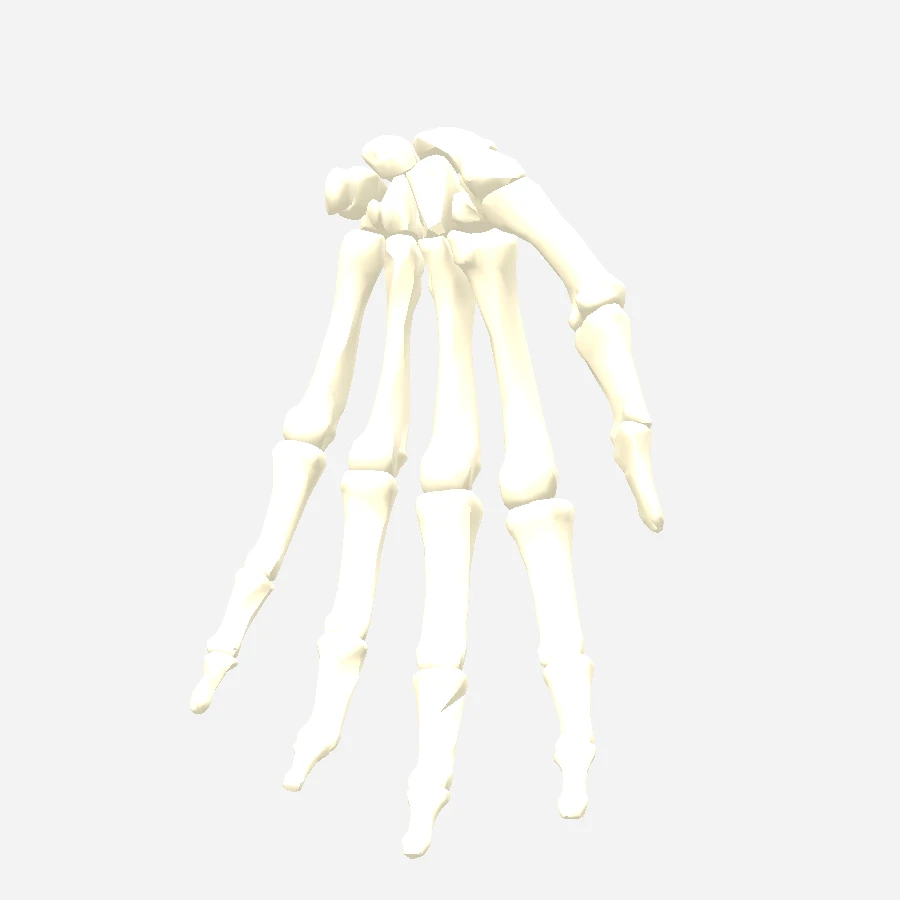

<div align="center">



# Human Atlas

**An interactive 3D atlas of human anatomy — 2,234 individually modelled structures,
15 systems, English and European Portuguese.**

Built for studying on an iPad, offline. Clone it and `npm run dev`.



</div>

---

Every structure here is a real mesh from
[BodyParts3D 4.0](https://dbarchive.biosciencedbc.jp/en/bodyparts3d/desc.html), the anatomical
model published by the Database Center for Life Science (DBCLS), Japan. Nothing is a stand-in
and nothing is generated.

Built from scratch, taking [ashemag/human-atlas](https://github.com/ashemag/human-atlas)
(MIT) as the reference for the model, the palette and the lighting — and then went well past
it, because the point was a tool someone could actually revise from: pick a region, peel the
muscles layer by layer, read the structure's name in Portuguese, cut the body open, pin what
matters, save the view, and have all of it work in a lecture hall with no wifi.

<table>
<tr>
<td width="25%"></td>
<td width="25%"></td>
<td width="25%"></td>
<td width="25%"></td>
</tr>
<tr>
<td align="center"><sub>One limb, one side</sub></td>
<td align="center"><sub>Skeleton</sub></td>
<td align="center"><sub>Trunk vessels</sub></td>
<td align="center"><sub>Hand, closer in</sub></td>
</tr>
</table>

## What it does

**Regions.** Head and neck, trunk, upper limb, lower limb, each with sub-regions (shoulder,
arm, forearm, hand; thigh, leg, foot; thorax, abdomen, pelvis) and a side switch, so a view
is a plate of one arm rather than a whole body. The view is trimmed to that area's own bone
box, so a vessel running out of the region is cut at the boundary instead of trailing away.

**Muscular layers.** Ten per region, peeled superficial-first with a fade — the deltoid and
brachioradialis first, then the flexor carpi radialis, the biceps, the brachialis, and the
deep flexors last. The order is measured, not typed in: see below.

**Plates.** A contents screen of cards per region — muscles and bones, bones, ligaments,
arteries, veins, nerves, organs, surface — plus a *Closer in* group for the sub-regions. Each
card's thumbnail is rendered by the viewer itself and cached on the device.

**Reading a structure.** Tap it for its name, its region, its volume, its FMA identifier and
a paragraph from Wikipedia; compare it against its contralateral partner (bars show the
volume of each side); isolate it, hide it, pin a label to it that follows the model as it
turns.

**Looking at it.** ANT / POS / LAT / MED / SUP / INF, with lateral and medial resolved
against the side you are studying; joint shortcuts (shoulder, elbow, wrist, hand, hip, knee,
ankle, foot, jaw, skull base, cervical spine, sternoclavicular, lumbar spine, sacroiliac);
transparency in three steps, where a selected structure stays solid inside a faded body and a
tap goes through anything ghosted; anatomical cuts on the sagittal, coronal and axial planes;
and an explode slider that scatters the body and then lays every one of the 2,234 pieces out
on a flat inventory wall.

**Portuguese.** Interface, system names, structure paragraphs and structure names. 925 names
are verified — against Wikidata and Wikipedia, and against a Portuguese myology table for the
muscles; the other 1,309 are derived mechanically from the English by an anatomical vocabulary
in the repo, and the panel marks a derived name as unverified rather than passing it off.

**Origin, insertion, action.** For 316 muscle meshes the panel carries the three fields a
student actually revises. They come from a myology table, which is course material: the
repo carries the muscle *names* it verifies (nomenclature is fact) and reads the descriptive
text from a local file that is not redistributed — `tools/extract-miologia.py` and
`npm run map:miologia` rebuild it from the PDF.

**On a tablet.** A thumb-reachable toolbar, 30 steps of undo, saved views, hide-interface for
a clean screenshot, add-to-home-screen, and one button that stores the whole 27 MB atlas on
the device so it works with no connection.

## Run it

```bash
npm install
npm run fetch:data       # ~145 MB download, unpacks to ~460 MB of OBJ meshes
npm run fetch:wikidata   # FMA -> Wikidata mapping (names in both languages)
npm run fetch:wikipedia  # lead paragraphs, English and Portuguese
npm run build:atlas      # ~60 s: decimates, derives, packs public/atlas/
npm run dev              # http://localhost:5180
```

The two fetch steps are cached and optional: without them the atlas still builds, and each
structure falls back to a sentence derived from the FMA hierarchy. `data/` is gitignored and
re-fetchable; `public/atlas/` (27 MB) is committed, so a clone runs the viewer without
touching the pipeline. `npm run build` produces a static `dist/`.

Checks: `npm run verify:atlas` (every packed binary), `npm run report:regions [name]` (where a
structure ended up), `npm run report:systems`, `npm run check:i18n` (no missing or
untranslated string).

## How the interesting parts work

**Regions are derived, not looked up.** BodyParts3D's part-of graph covers only 1,258 of the
2,234 meshes and has no `upper limb` concept at all. So name rules give 279 bones a
sub-region, and every other structure inherits the region of the skeleton it lies against,
by nearest-neighbour over a uniform grid. Anchors are sampled at a fixed spacing rather than
a fixed count per bone — a wrist full of small dense bones would otherwise out-vote the femur
beside it. Anatomical naming then breaks the ties geometry cannot, but only between regions
the geometry already found. And a structure has to be 5 cm across to belong to two regions:
in the anatomical position the hands hang beside the hips, which was quietly putting pelvic
structures in the arm.

**Layers are measured the way a plate defines them.** 110 rays per muscle, cast outward from
points spread over its surface *by area* (vertex-stride sampling let the finely tessellated
tendon at the wrist speak for a whole muscle), through a grid holding the 402 muscles plus 642
blockers — bones and organs hide what is behind them but are never peeled. Each ray remembers
*which* muscles cover it, so the iterative peel is set arithmetic rather than new casts: what
can see out now is this layer, and once it is gone, whatever became visible is the next.

**Joints are found, not typed.** A joint is where two bones almost touch, so each definition
names two bones by pattern and the build takes the closest pair of sampled vertices between
them, and the midpoint. Twenty-five landmarks, both sides where it applies.

**Portuguese is grammar, not translation.** A lexicon carries nouns with their gender,
adjectives in both forms, ordinals, and the multi-word Latin terms that must match whole.
The deriver finds the head noun where English leaves it (last), reverses the modifier stack
the way Portuguese reads it, agrees every adjective in gender and number, moves the side word
to the end, contracts *of* into do/da/dos/das — and refuses the job when less than 70% of a
phrase is vocabulary it knows. "Posterior Segmental Branch of Right Hepatic Artery" comes out
as *Ramo segmentar posterior da artéria hepática direita*.

**The renderer draws the whole body in ~15 calls.** 2,234 meshes would mean 2,234 draw calls,
so each system is merged into one geometry carrying a `pid` vertex attribute, and all per-part
state — visibility, centroid, inventory slot, selection, opacity, layer — lives in float
textures indexed by that id. `onBeforeCompile` extends three's own standard material, so the
per-structure logic rides along with real image-based lighting: the vertex stage dequantises
the position and blends between assembled, scattered and inventory-wall placement; the
fragment stage discards what is hidden, peeled or outside the cut box, and tints the
selection. Picking renders a 1×1 pixel id-buffer under the finger. Transparency needs a
second mesh per system, because one material writes depth for all its fragments or none —
which is what lets a selected structure stay solid inside a glass body.

**The atlas format.** One gzipped binary per system: `ATL1` magic, a JSON header listing each
part's vertex and index ranges, then 4-byte-aligned buffers — positions as `Uint16`
(dequantised in the shader), normals as normalized `Int16`, a `Uint16` global part id, and a
`Uint32` index. Decimation is meshoptimizer to 22% of each part's triangles with the error
bounded to 0.2% of its extent (6.7 M → 2.4 M), and the authored `vn` normals travel with the
surviving vertices: recomputing them is what made every muscle look like plastic.

## Layout

| Path | Role |
| --- | --- |
| `tools/fetch-*.mjs` | BodyParts3D meshes, Wikidata mapping, Wikipedia leads |
| `tools/build-atlas.mjs` | the pipeline: decimate, derive, transform, pack `public/atlas/` |
| `tools/regions.mjs` · `layers.mjs` · `landmarks.mjs` | regions and sides · muscular layers · joints |
| `tools/pt-terms.mjs` · `pt-derive.mjs` | Portuguese vocabulary · the derivation |
| `tools/verify.mjs` · `report-*.mjs` · `check-i18n.mjs` | the safety net |
| `src/viewer.js` | three.js scene, materials, picking, cuts, filters, thumbnails |
| `src/main.js` | UI: toolbar, regions, contents, pins, saved views, search |
| `src/presets.js` · `thumbs.js` · `bookmarks.js` · `offline.js` | plates · thumbnail cache · saved views · service worker |

`PLAN.md` is what was built and why; `HANDOFF.md` is the state of the project and the open
decisions.

## Licence and credit

Anatomical data: **BodyParts3D, © The Database Center for Life Science**, licensed under
[CC Attribution-Share Alike 2.1 Japan](https://creativecommons.org/licenses/by-sa/2.1/jp/deed.en).
Structure paragraphs and verified Portuguese names come from **Wikipedia** and **Wikidata**
(CC BY-SA and CC0). Structure identifiers derive from the Foundational Model of Anatomy (FMA).
The reference implementation, [ashemag/human-atlas](https://github.com/ashemag/human-atlas),
is MIT. This viewer is distributed under CC BY-SA — see `NOTICE`.

Built by [Mono Bola](https://github.com/MonoBL).
